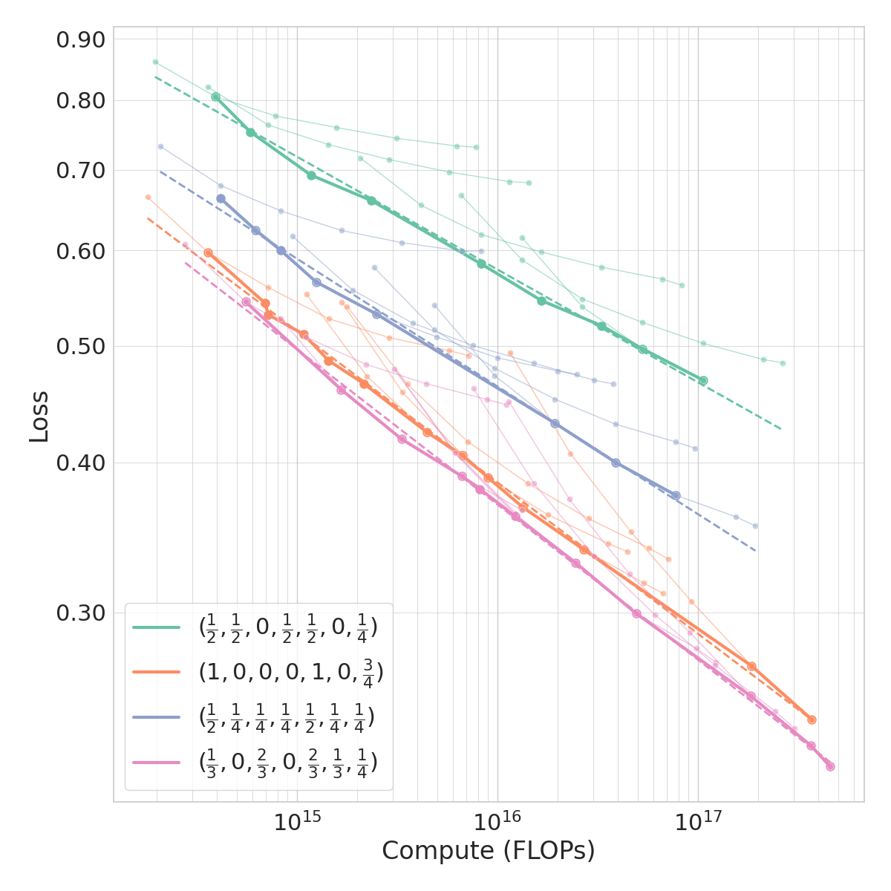

# Searching for Efficient Linear Layers over a Continuous Space of Structured Matrices
This repository contains the code for the paper [Searching for Efficient Linear Layers over a Continuous Space of Structured Matrices](https://arxiv.org/abs/2406.06248)
by Andres Potapczynski, Shikai Qiu, Marc Finzi, Christopher Ferri, Zixi Chen, Micah Goldblum, Bayan Bruss, Christopher
De Sa and Andrew Gordon Wilson.

<!---
<table>
  <tr>
    <td></td>
    <td></td>
  </tr>
</table>
-->

<figure>
  
</figure>

Dense linear layers are the dominant computational bottleneck in large neural networks, presenting a critical need for more efficient alternatives.
Previous efforts focused on a small number of hand-crafted structured matrices and neglected to investigate whether these structures can surpass dense layers in terms of compute-optimal scaling laws when both the model size and training examples are optimally allocated.
In this work, we present a unifying framework that enables searching among all linear operators expressible via an Einstein summation.
This framework encompasses many previously proposed structures, such as low-rank, Kronecker, Tensor-Train, Block Tensor-Train (BTT), and Monarch, along with many novel structures.
To analyze the framework, we develop a taxonomy of all such operators based on their computational and algebraic properties and show that differences in the compute-optimal scaling laws are mostly governed by a small number of variables that we introduce.
Namely, a small ω (which measures parameter sharing) and large ψ (which measures the rank) reliably led to better scaling laws, while
ν (which measures how much structured an operator is) can be varied with often negligible impact on the scaling laws.
Guided by the insight that full-rank structures that maximize parameters per unit of compute perform the best, we propose BTT-MoE, a novel Mixture-of-Experts (MoE) architecture obtained by sparsifying computation in the BTT structure, providing a substantial compute-efficiency gain over dense layers and standard MoE.

Please cite this work as:
```bibtex
@article{potapczynski2024einsum,
    title={{Searching for Efficient Linear Layers over a Continuous Space of Structured Matrices}},
    author={Andres Potapczynski, Shikai Qiu, Marc Finzi, Christopher Ferri, Zixi Chen, Micah Goldblum, Bayan Bruss, Christopher De Sa and Andrew Gordon Wilson},
    journal={Advances in Neural Information Processing Systems},
    year={2024}
}
```

## Setup
To setup the environment, simply run
```
source setup.sh
```
This script installs two conda environments named `struct` and `gpt`. Use the `struct` for CIFAR and MLP experiments, and `gpt` for GPT-2 experiments. `struct` has more complex dependencies and will take a while to install.

The basic GPT-2 training code and model definition is adapted from [nanoGPT](https://github.com/karpathy/nanoGPT/tree/master). `train_onepass.py`, `train_synth.py`, and the directory `scaling_mlps` are forked from the repo [scaling_mlps](https://github.com/gregorbachmann/scaling_mlps/tree/main). 

## Datasets

### Small Vocabulary OpenWebText
```
conda activate gpt
python data/small_vocab_owt.py
```

### Original OpenWebText
```
conda activate gpt
python data/owt.py
```

### CIFAR-10
Create ffcv dataset for fast loading:
```
conda activate struct
python scaling_mlps/data_utils/dataset_to_beton.py --dataset_name cifar10 --mode train --res 32
python scaling_mlps/data_utils/dataset_to_beton.py --dataset_name cifar10 --mode val --res 32
```

### CIFAR-5M ###
Download the original CIFAR-5M dataset from https://github.com/preetum/cifar5m, and update `DATASET_DIR` in `scaling_mlps/data_utils/dataset_to_beton.py`. Then make the ffcv dataset for fast loading:
```
conda activate struct
python scaling_mlps/data_utils/dataset_to_beton.py --dataset_name cifar5m --mode train --res 32
python scaling_mlps/data_utils/dataset_to_beton.py --dataset_name cifar5m --mode val --res 32
```

## Experiments
### GPT-2 on Small Vocabulary OpenWebText
```
conda activate gpt
# Figure 4
sh experiments/gpt2.sh
# Figure 6, 7
sh experiments/moe.sh
```


### Next Pixel Prediction on CIFAR-5M ###
```
conda activate struct
# Figure 5 top
sh experiments/cifar5m.sh
```

### MLP Regression ###
```
conda activate struct
# Figure 5 bottom
sh experiments/mlp.sh
```